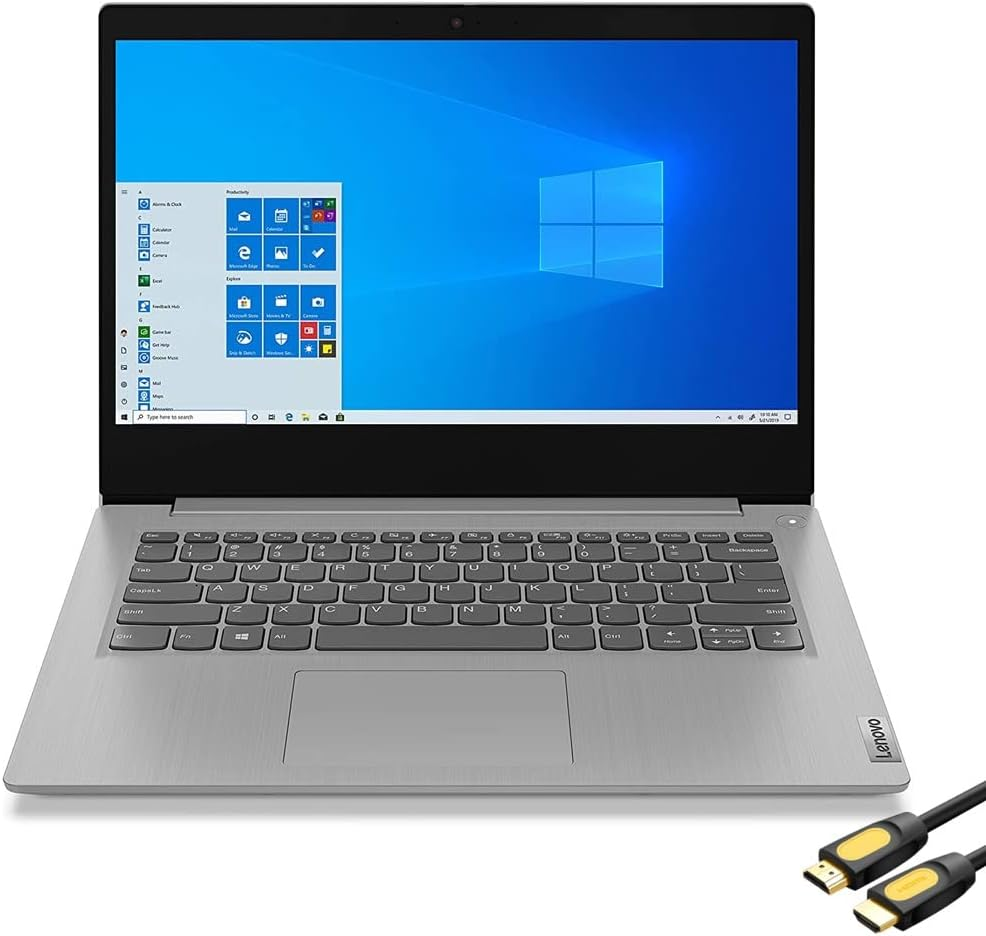

# keria1001.github.io

## lenovo IdeaPad 

## Keria's Recomendation

### lenovo Ideapad

- cpu-> 6,157
- RAM-> 8GB
- Storage-> 512gb

## Resources

1. https://www.cpubenchmark.net/
2. https://www.amazon.com/Lenovo-IdeaPad-Business-Student-i3-1115G4/dp/B0BSR6N4WY/ref=sr_1_2_sspa?crid=31ZBEMBLDQUC1&keywords=lenovo+laptop&qid=1689560155&refinements=p_n_feature_thirty-three_browse-bin%3A23720419011&rnid=23720416011&s=pc&sprefix=lenovo+%2Caps%2C196&sr=1-2-spons&sp_csd=d2lkZ2V0TmFtZT1zcF9hdGY&psc=1 
